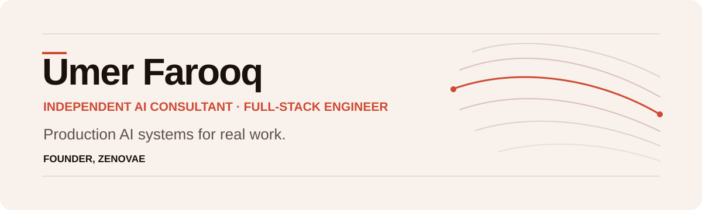

<!-- @M-Umer-Farooq-Dev/M-Umer-Farooq-Dev -->

  <a href="https://umerfarooq.me">
    <picture>
      <source media="(prefers-color-scheme: dark)" srcset="./assets/profile-hero-dark.svg">
      <source media="(prefers-color-scheme: light)" srcset="./assets/profile-hero-light.svg">
      
    </picture>
  </a>

  

    <a href="https://umerfarooq.me">Website</a> ·
    <a href="https://zenovae.ai">Zenovae</a> ·
    <a href="https://www.linkedin.com/in/dev-umer-farooq/">LinkedIn</a> ·
    <a href="mailto:umerfarooqqq2010@gmail.com">Email</a>
  

## AI systems for real work

I turn document-heavy work, scattered company knowledge, repetitive customer conversations, and disconnected tools into production software. I work directly with founders and operating teams—from the first workflow review through production handoff.

| **$1M+** | **$37K+** | **500K+** | **80,000** |
|:---:|:---:|:---:|:---:|
| value delivered | largest engagement | documents made searchable | research frames evaluated |

## Selected work

| System | Proof | What changed |
|---|---|---|
| [Enterprise document automation](https://umerfarooq.me/work/enterprise-document-automation) | **$37K+ · 943 hours · thousands/day** | Replaced manual processing with a checked flow from submitted documents to business systems. |
| [Knowledge search across 500K+ documents](https://umerfarooq.me/work/knowledge-search-500k-documents) | **Source-backed · access-controlled · sub-second** | Helped authorized users find useful answers and inspect the source behind each result. |
| [Controlled multi-step AI workflows](https://umerfarooq.me/work/controlled-ai-workflows) | **Four stages · human approval points** | Split research, drafting, checking, and review into production steps with people controlling risky decisions. |
| [Spreadsheet and database automation](https://umerfarooq.me/work/spreadsheet-database-automation) | **~90% less manual maintenance** | Moved large datasets between Google Sheets and PostgreSQL with conflict handling and monitoring. |

[Review all case studies →](https://umerfarooq.me/work)

## What I build

- **Production AI:** RAG and source-backed knowledge systems, AI agents, document automation, Voice AI, and human-in-the-loop workflows.
- **Product engineering:** Python, FastAPI, Node.js, TypeScript, React, Next.js, PostgreSQL, MongoDB, and system integrations.
- **Reliable delivery:** Containerized deployments, cloud infrastructure, permissions, monitoring, edge-case handling, and production handoff.

## Currently building

- **[Zenovae](https://zenovae.ai)** — AI integrations and agents for service businesses.
- **shipkit** — An open-source TypeScript CLI for directory submissions, with 18 adapters.

## Published research

My IEEE-published biometric-security research evaluated deep-learning anti-spoofing methods across **80,000 RGB and thermal frames**, helping face-recognition systems reject photos, videos, and masks used as fake inputs.

[Read the plain-language summary](https://umerfarooq.me/work/face-anti-spoofing-research) · [View the IEEE publication](https://ieeexplore.ieee.org/document/10131510/)

---

  <strong>Bring me the workflow that keeps costing your team time.</strong>
    
  <a href="https://umerfarooq.me">Discuss your system</a> ·
  <a href="https://www.linkedin.com/in/dev-umer-farooq/">Connect on LinkedIn</a>

